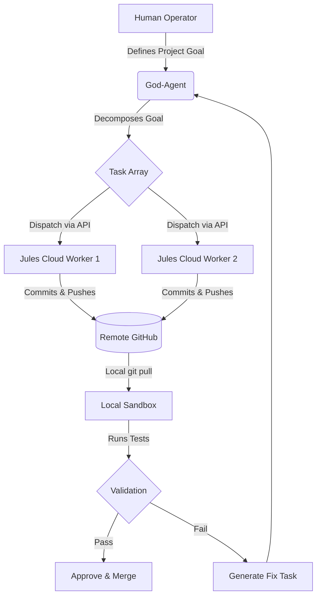

<div align="center">
  
  
  # ⚕️ Asclepius
  **The Single-Agent Orchestrator (God-Agent v3)**
  
  <p>
    A hyper-lean, Zero-Auth cognitive management plane. Asclepius is the Mind. The Cloud is the Muscle.
  </p>

  [](#)
  [](#)
  [](#)
</div>

---

## 🌌 The Paradigm Shift

Asclepius abandons the bloated, slow "multi-local-agent" architecture. Instead, it utilizes a **Single God-Agent** on your local machine that orchestrates an army of stateless `jules.google.com` cloud workers. 

*   **Zero-Auth Remote:** The local app never authenticates with GitHub. Jules workers push code using their own cloud identities.
*   **Absolute Local Authority:** Asclepius pulls the pushed branches to your local disk, runs sandbox verifications, and manages the merge loop.

## ⚙️ The Autonomous Pipeline

The core execution loop of the God-Agent is relentless and fully automated:



## 🚀 Quick Start

Ensure you have Node.js 20+ installed.

```bash
# 1. Install dependencies
npm install

# 2. Start the God-Agent Dashboard
npm run dev
```

Open `http://localhost:5173` to access the Mission Control panel.

## 🏗️ Core Directory Structure

The codebase is strictly separated into cognitive logic, UI, and cloud integrations.

```text
asclepius/
├── CONSTITUTION.md          # 📜 Immutable Architectural Law
├── README.md                # 📖 You are here
├── src/
│   ├── agents/              # Core God-Agent cognitive loop & task decomposition
│   ├── components/          # React UI (Mission Control, Connections)
│   ├── hooks/               # Persistent local storage (Tokens, Paths)
│   ├── types/               # TypeScript models (JulesWorker, PipelineTask)
│   └── App.tsx              # Application entrypoint & dashboard
```

## 🔑 Connecting a Jules Worker

1. Open the Dashboard.
2. Under **Connect Jules Worker**, enter the API Endpoint (e.g., `https://jules.google.com/api/v1`).
3. Paste the Bearer Auth Token or Session Cookie.
4. The worker is now in the **Pool** and ready to receive JSON task payloads.

---
<div align="center">
  <i>"Stability over raw speed. Always."</i>
</div>
