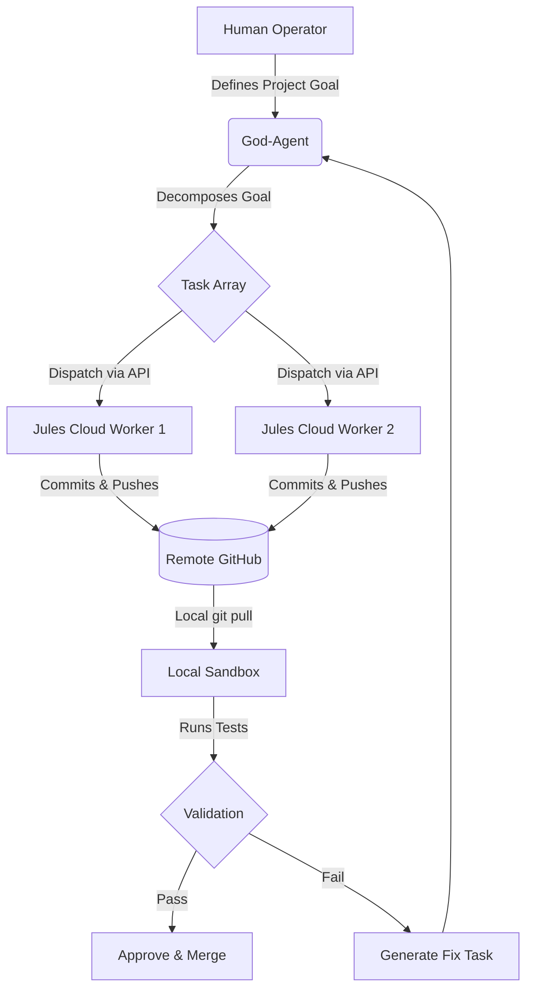

<div align="center">
  
  
  # ⚕️ Asclepius
  **The Single-Agent Orchestrator (God-Agent v3)**
  
  <p>
    A hyper-lean, Zero-Auth cognitive management plane. Asclepius is the Mind. The Cloud is the Muscle.
  </p>

  [](#)
  [](#)
  [](#)
</div>

---

## 🌌 The Paradigm Shift: The Resource-Oriented Workforce

Asclepius abandons the bloated, slow "multi-local-agent" architecture. Instead, it utilizes a strictly decoupled **Resource-Oriented AI System**:

1.  **Agents (The Brains):** Pure intelligence profiles (e.g., God Agent, UI/UX Expert) powered by LLM providers (Gemini, Claude, Ollama). The **God Agent** orchestrates everything.
2.  **Workers (The Seats):** Persistent, named execution accounts (e.g., Athena, James, Artemis). A worker is *not* an AI; it is an identity/seat that connects to external tools.
3.  **Tools (The Hands):** Specific software endpoints (e.g., `jules.google`, CapCut API, GitHub) that Workers use to execute code and build applications.
4.  **Skills (The Context):** Pre-compiled framework documentation generated by **Skill Seekers** to inject instant domain expertise.
5.  **Graphify (The Map):** The underlying knowledge graph engine that maps codebase architecture for precise context retrieval.

## ⚙️ The Autonomous Pipeline

The core execution loop of the God-Agent is relentless and fully automated:



## 🚀 Quick Start

Ensure you have Node.js 20+ installed.

```bash
# 1. Install dependencies
npm install

# 2. Start the God-Agent Dashboard
npm run dev
```

Open `http://localhost:5173` to access the Mission Control panel.

## 🏗️ Core Directory Structure

The codebase is strictly separated into cognitive logic, UI, and cloud integrations.

```text
asclepius/
├── CONSTITUTION.md          # 📜 Immutable Architectural Law
├── README.md                # 📖 You are here
├── src/
│   ├── agents/              # Core God-Agent cognitive loop & task decomposition
│   ├── components/          # React UI (Mission Control, Connections)
│   ├── hooks/               # Persistent local storage (Tokens, Paths)
│   ├── types/               # TypeScript models (JulesWorker, PipelineTask)
│   └── App.tsx              # Application entrypoint & dashboard
```

## 🔑 Connecting a Worker

1. Open the Dashboard.
2. Under **Agent Fleet**, configure your **God Agent** (Intelligence Provider & API Vault).
3. Assign a specific AI Brain to a **Worker** (e.g., assign the "Backend Agent" to the "James" worker).
4. Configure the Worker's **Tools** (e.g., providing a `jules.google.com` token to James).
5. The God Agent will now delegate tasks to the appropriate Worker based on their configured Tools.

---
<div align="center">
  <i>"Stability over raw speed. Always."</i>
</div>
